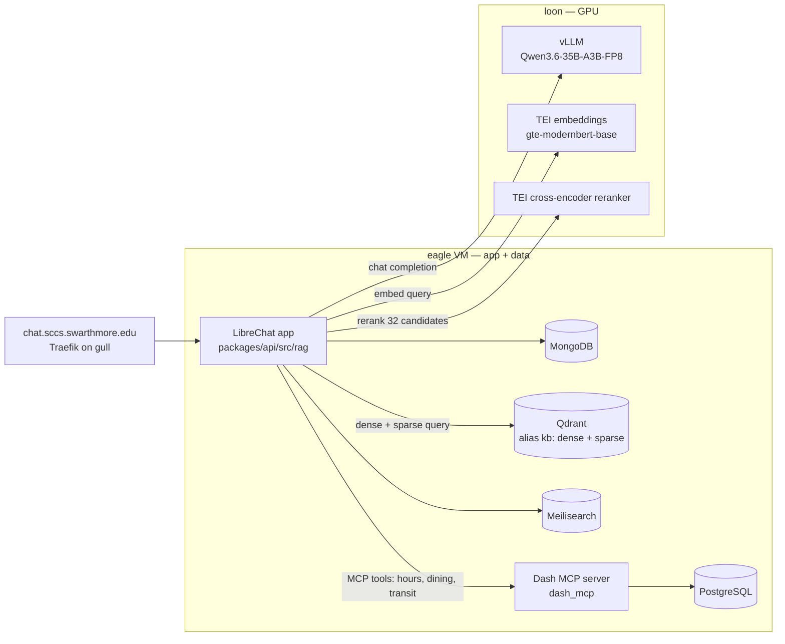

# SwatGPT

Swarthmore College's campus LLM assistant: self-hosted inference plus a custom hybrid retrieval pipeline over a scraped copy of the college's knowledge base, live at [chat.sccs.swarthmore.edu](https://chat.sccs.swarthmore.edu) behind SCCS single sign-on.



## Why it's interesting

- **Hybrid retrieval with a guaranteed entity slot.** Dense-only retrieval failed on questions that named a campus place. "Is Cornell open late?" embedded as a question about library hours, the reranker filled all eight slots with near-duplicate hours chunks, and the model answered from its prior. The fix ([`e06f55d`](https://github.com/swat-sccs/SwatGPT/commit/e06f55d23)) adds an IDF-weighted sparse lexical channel, reranks the deduplicated union of both channels, and reserves one slot for the best lexical hit. See `selectTopChunks` in [`retrieve.ts`](packages/api/src/rag/retrieve.ts).
- **Retrieval that cannot take the chat down.** Every message runs three network hops (embed, search, rerank) under one 1.5 s `AbortController` budget. Any timeout, non-2xx, empty result, or missing config resolves to `undefined` and the message proceeds without context ([`retrieve.ts`](packages/api/src/rag/retrieve.ts), tests in [`retrieve.spec.ts`](packages/api/src/rag/retrieve.spec.ts)).
- **Two tokenizers that must agree byte for byte.** Sparse vectors are FNV-1a hashes of lowercase alphanumeric tokens, computed in Python at ingest time and in TypeScript at query time. If either side drifts, the lexical channel silently returns garbage, so the tokenizer is pinned in both [`ingest.py`](ingest/ingest.py) and [`lexical.ts`](packages/api/src/rag/lexical.ts) with the IDF modifier applied server-side by Qdrant.
- **Zero-downtime corpus rebuilds.** Ingest writes a fresh `kb_<timestamp>` collection, embeds and upserts the whole corpus, then atomically repoints the `kb` alias and drops old collections. The app only ever queries the alias ([`ingest.py`](ingest/ingest.py), [`search.ts`](packages/api/src/rag/search.ts)).

## Architecture

Two hosts split the work. `loon` holds the GPU and runs only GPU services: vLLM for generation and two [TEI](https://github.com/huggingface/text-embeddings-inference) containers for embeddings and reranking, all reached over plain HTTP. `eagle` is a VM running this repo's Compose stack: the app, MongoDB, Qdrant, Meilisearch, and a Model Context Protocol server with its own PostgreSQL for live campus data ([`docker-compose.yml`](docker-compose.yml), [`docker-compose.override.yml`](docker-compose.override.yml)). Traefik on a third host fronts it as `chat.sccs.swarthmore.edu`.

The split exists so the stateful tier can be deployed, rebuilt, and backed up without touching the GPU box, and so a GPU-side failure degrades instead of cascading. If TEI or Qdrant is slow or gone, retrieval fails open and users get a plain chatbot. If vLLM is gone there is no chat, but the app, its data, and the search index are untouched and come back the moment inference does. Deploys run on a self-hosted GitHub Actions runner on `eagle`: reset the tree to the pushed commit, rebuild the app and MCP images, `compose up`, poll the app health endpoint for up to 150 s, then fail the deploy if the MCP container is unhealthy or the app registered it with zero tools ([`production.yml`](.github/workflows/production.yml)).

## Retrieval pipeline

Retrieval is custom TypeScript in [`packages/api/src/rag/`](packages/api/src/rag). It has no framework on the query path and is invoked once per message from the agent client, in parallel with the rest of message building ([`client.js`](api/server/controllers/agents/client.js), `buildMessages`).

1. **Embed** the latest user message via TEI's OpenAI-compatible endpoint, 768-dim ([`embed.ts`](packages/api/src/rag/embed.ts)). In parallel, hash the query into a sparse term-frequency vector ([`lexical.ts`](packages/api/src/rag/lexical.ts)).
2. **Hybrid search** Qdrant with both named vectors in parallel, top 20 per channel. Results are merged by point id, each candidate tagged with its rank in the lexical channel, and capped at 32 because that is TEI's default max rerank batch ([`search.ts`](packages/api/src/rag/search.ts)).
3. **Rerank** all candidates against the query with a cross-encoder ([`rerank.ts`](packages/api/src/rag/rerank.ts)).
4. **Select** the top 8 above a 0.3 score floor. If no lexical top-3 hit survived, the best one replaces the last slot ([`retrieve.ts`](packages/api/src/rag/retrieve.ts)).
5. **Assemble context** as numbered entries with title, section breadcrumb, and source URL, prefixed with a cite-your-sources instruction ([`format.ts`](packages/api/src/rag/format.ts)). This lands in the agent's shared run context after the static system prompt so vLLM prefix caching still hits.

Offline, [`ingest/ingest.py`](ingest/ingest.py) chunks the markdown corpus with heading-aware splitting (512 tokens, 64 overlap), batch-embeds through TEI, computes the sparse vectors, and does the alias swap. LlamaIndex is used for chunking only and never imported at query time.

## Testing

[`retrieve.spec.ts`](packages/api/src/rag/retrieve.spec.ts) exercises the real pipeline with only `fetch` replaced: ordering by rerank score, exact wire payloads to all three services, cross-channel deduplication, the lexical guarantee and its interaction with the score floor, and every fail-open branch (unreachable embedder, Qdrant non-2xx, reranker failure, elapsed budget, no hits, feature unset, empty query). The regression it is built to catch is the one that motivated the hybrid rewrite: a change to candidate selection that lets topical chunks push the named entity's chunk out of context.

`ingest.py --verify` runs a handful of smoke queries against the live `kb` alias and prints the top hits. There is no scored answer-accuracy harness yet.

## Numbers

Only figures checkable from this repository.

| | |
|---|---|
| Corpus | 3,528 markdown docs (487 KB articles, 1,080 site pages, 1,961 catalog entries), 18 MB in [`information/`](information) |
| Chunking | 512 tokens, 64 overlap |
| Candidate pool | dense top 20 + sparse top 20, deduped, capped at 32 |
| Context | top 8 chunks, rerank floor 0.3, one reserved lexical slot |
| Retrieval budget | 1.5 s end to end, fail open |
| Fork delta | ~150 files, +8.2k / −0.8k lines vs upstream `v0.8.8-rc1`, excluding the corpus and lockfile |

## Divergence from LibreChat

This started as a fork of [LibreChat](https://github.com/danny-avila/LibreChat) `v0.8.8-rc1` and still inherits the chat UI, agent runtime, Express server, MongoDB models, Meilisearch conversation search, and the admin panel.

Replaced or added:

- **Retrieval.** LibreChat's `rag_api` service and pgvector were removed from the Compose stack ([`c6ea67a`](https://github.com/swat-sccs/SwatGPT/commit/c6ea67ad7)) in favour of the pipeline above plus Qdrant. The only touch point in `/api` is the retrieval promise added to `buildMessages`.
- **Corpus and ingestion.** Three scrapers ([`scrape_kb.py`](scrape_kb.py), [`scrape_www.py`](scrape_www.py), [`scrape_catalog.py`](scrape_catalog.py)) for the MediaWiki knowledge base, the public site, and the course catalog, and the ingest pipeline.
- **Live campus data.** [`dash_mcp/`](dash_mcp) is a read-only MCP server over the public data shown by [The Dash](https://dash.swarthmore.edu/): campus hours, dining menus, events, SEPTA departures, alerts. It polls upstream into PostgreSQL so tool calls read a snapshot instead of blocking on the Dash, with a bounded read-through for dining lookups and a watchdog that kills the process after three failed health probes. It is the only MCP server the model spec exposes ([`librechat.yaml`](librechat.yaml)).
- **Inference.** A single enforced model spec pointed at the vLLM endpoint, with thinking disabled per request through `chat_template_kwargs` ([`librechat.yaml`](librechat.yaml)).
- **Auth.** Email login and registration off; OpenID Connect against SCCS's Keycloak is the only login path.
- **Surface area.** Builders, prompts, agents, skills, marketplace, user-added MCP servers, and sharing are disabled by config, plus a new `projects` interface flag and route-level gating so disabled features are unreachable, not just hidden ([`InterfaceGate.tsx`](client/src/routes/InterfaceGate.tsx)).
- **Branding.** SCCS palette and identity.

## Running locally

Standard LibreChat monorepo. Backend TypeScript lives in `packages/api`; `/api` is the legacy JS layer.

```bash
npm run smart-reinstall   # install + build packages
npm run backend:dev       # :3080
npm run frontend:dev      # :3090
cd packages/api && npx jest rag   # retrieval tests
```

Point `.env` at any OpenAI-compatible chat endpoint. Retrieval activates only when `TEI_EMBEDDINGS_URL`, `TEI_RERANK_URL`, and `QDRANT_URL` are all set; without them it fails open and you get a plain chatbot. To build the index, see [`ingest/README.md`](ingest/README.md).

**Stack:** Node 24 / Express / React, TypeScript, MongoDB, Qdrant, Meilisearch, PostgreSQL, MCP, vLLM, Hugging Face TEI, Docker Compose, GitHub Actions self-hosted runner, Traefik.

Built on LibreChat by Danny Avila and contributors (MIT, see [LICENSE](LICENSE)). Maintained by the [Swarthmore College Computer Society](https://sccs.swarthmore.edu).
